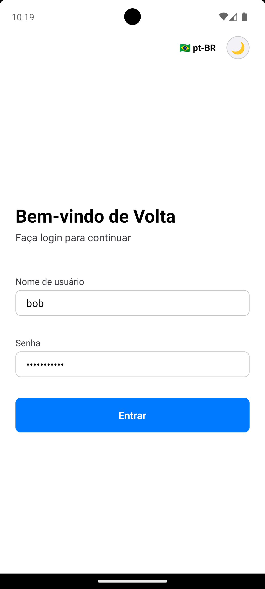

# Aplicação de Chat em Tempo Real - React Native

Uma aplicação de chat em tempo real full-stack construída com **React Native** (bare, sem Expo), **Node.js/Express**, **MongoDB**, **Socket.IO** e **TypeScript**. O frontend segue os princípios de **Clean Architecture** organizado por **contextos delimitados** (auth, users, chat) e usa **Zustand** para gerenciamento de estado.

---

## 📋 Índice

- [Demonstração](#-demonstração)
- [Visão Geral da Arquitetura](#visão-geral-da-arquitetura)
- [Stack Tecnológica](#stack-tecnológica)
- [Estrutura do Projeto](#estrutura-do-projeto)
- [Pré-requisitos](#pré-requisitos)
- [Instalação e Configuração](#instalação-e-configuração)
- [Executando a Aplicação](#executando-a-aplicação)
- [Documentação da API](#documentação-da-api)
- [Eventos WebSocket](#eventos-websocket)
- [Funcionalidades](#funcionalidades)
- [Testes](#testes)
- [Solução de Problemas](#solução-de-problemas)

---

## 🎬 Demonstração

### Vídeo Demo

<!-- Opção 1: GIF animado (recomendado) -->
<!-- Converta o vídeo para GIF usando: ffmpeg -i assets/demo.mp4 -vf "fps=10,scale=320:-1:flags=lanczos" assets/demo.gif -->
<!--  -->

<!-- Opção 2: Link para vídeo -->

[📹 Assistir Demo (MP4)](./assets/demo.mp4)

<!-- Opção 3: Tag HTML5 (funciona em alguns visualizadores) -->
<details>
<summary>🎥 Visualizar Demo Inline</summary>

<video width="100%" controls>
  <source src="./assets/demo.mp4" type="video/mp4">
  <p>Seu navegador não suporta a tag de vídeo. <a href="./assets/demo.mp4">Clique aqui para baixar o vídeo</a>.</p>
</video>

</details>

### Screenshots

<div align="center">
  
  
  
</div>

---

## 🏗️ Visão Geral da Arquitetura

### Arquitetura do Frontend

O frontend segue **Clean Architecture** organizada por **contextos delimitados**:

```
frontend/src/
├── auth/              # Contexto delimitado de autenticação
│   ├── domain/        # Entidades, objetos de valor, interfaces de repositório
│   ├── application/   # Casos de uso (lógica de negócio)
│   ├── infrastructure/# HTTP, mappers, implementações de repositório
│   └── presentation/  # Telas, view models (Zustand), componentes
├── users/             # Contexto delimitado de usuários
├── chat/              # Contexto delimitado de chat
├── core/              # Componentes UI compartilhados, navegação, tema
└── shared/            # Preocupações transversais (HTTP, storage, DI)
```

**Princípios Fundamentais:**

- **Camada de domínio**: TypeScript puro, sem dependências de frameworks
- **Camada de aplicação**: Casos de uso orquestram regras de negócio
- **Camada de infraestrutura**: DTOs, clientes API, WebSocket, implementações de repositório
- **Camada de apresentação**: Componentes React, stores Zustand, view models

### Arquitetura do Backend

```
backend/src/
├── config/            # Ambiente, banco de dados, passport, logger
├── modules/
│   ├── auth/          # Autenticação (JWT, Passport Local)
│   ├── users/         # Gerenciamento de usuários
│   └── chat/          # Mensagens e handlers Socket.IO
├── middlewares/       # Tratamento de erros, autenticação
└── utils/             # Utilitários de hash, JWT
```

---

## 🛠️ Stack Tecnológica

### Backend

- **Node.js** + **Express** + **TypeScript**
- **MongoDB** (via Mongoose)
- **Socket.IO** (mensagens em tempo real)
- **Passport.js** (estratégia Local) + **JWT**
- **bcrypt**, **Zod**, **Winston**, **Helmet**, **CORS**
- **Docker** e **Docker Compose**

### Frontend

- **React Native** 0.82 (bare, sem Expo)
- **TypeScript**
- **Zustand** (gerenciamento de estado)
- **React Navigation** (native stack)
- **Axios** (HTTP)
- **Socket.IO Client** (WebSocket)
- **AsyncStorage** (armazenamento de token)

---

## 📁 Estrutura do Projeto

```
react-native-realtime-chat/
├── docker-compose.yml
├── .env.example
├── README.md
├── scripts/
│   ├── start-backend-docker.sh
│   ├── seed.sh
│   └── dev-setup.sh
├── backend/
│   ├── Dockerfile
│   ├── package.json
│   ├── tsconfig.json
│   ├── .env.example
│   ├── src/
│   │   ├── server.ts
│   │   ├── app.ts
│   │   ├── config/
│   │   ├── modules/ (auth, users, chat)
│   │   ├── middlewares/
│   │   └── utils/
│   └── tests/
└── frontend/
    ├── android/
    ├── ios/
    ├── src/
    │   ├── auth/
    │   ├── users/
    │   ├── chat/
    │   ├── core/
    │   ├── shared/
    │   └── app/
    └── __tests__/
```

---

## ✅ Pré-requisitos

- **Node.js** >= 20
- **Docker** e **Docker Compose**
- **iOS**: macOS com Xcode, CocoaPods
- **Android**: Android Studio, JDK 17

---

## 📦 Instalação e Configuração

### 1. Clone o repositório

```bash
git clone <repository-url>
cd react-native-realtime-chat
```

### 2. Execute a configuração automatizada

```bash
chmod +x scripts/*.sh
./scripts/dev-setup.sh
```

Isso irá:

- Instalar dependências do backend
- Instalar dependências do frontend
- Instalar pods do iOS (apenas macOS)

### 3. Configure as variáveis de ambiente

```bash
cp .env.example .env
cp backend/.env.example backend/.env
```

Edite `backend/.env` se necessário (os padrões funcionam para desenvolvimento local).

---

## 🚀 Executando a Aplicação

### Backend (Docker)

```bash
# Iniciar MongoDB + Backend
./scripts/start-backend-docker.sh

# Ou manualmente:
docker compose up --build
```

O backend rodará em **http://localhost:3001**

### Popular o Banco de Dados

```bash
./scripts/seed.sh
```

Cria usuários de teste:

- `alice` / `password123`
- `bob` / `password123`
- `charlie` / `password123`

### Frontend

#### iOS (apenas macOS)

```bash
cd frontend
npm run ios
```

**Configuração de Rede**: Usa `http://localhost:3001`

#### Android

```bash
cd frontend
npm run android
```

**Configuração de Rede**: Usa `http://10.0.2.2:3001` (emulador Android)

**Alternativa** (se usando dispositivo físico):

```bash
adb reverse tcp:3001 tcp:3001
```

Depois atualize `frontend/src/shared/config/env.ts` para usar `localhost:3001`.

---

## 📡 Documentação da API

### URL Base

```
http://localhost:3001/api
```

### Endpoints

#### **Autenticação**

**Registrar**

```bash
POST /api/auth/register
Content-Type: application/json

{
  "name": "João Silva",
  "username": "joaosilva",
  "password": "password123"
}

Resposta: 201 Created
{
  "status": "success",
  "message": "Usuário registrado com sucesso"
}
```

**Login**

```bash
POST /api/auth/login
Content-Type: application/json

{
  "username": "alice",
  "password": "password123"
}

Resposta: 200 OK
{
  "status": "success",
  "data": {
    "accessToken": "eyJhbGciOiJIUzI1NiIsInR5cCI6IkpXVCJ9...",
    "refreshToken": "eyJhbGciOiJIUzI1NiIsInR5cCI6IkpXVCJ9...",
    "user": {
      "id": "507f1f77bcf86cd799439011",
      "name": "Alice Smith",
      "username": "alice"
    }
  }
}
```

**Atualizar Token**

```bash
POST /api/auth/refresh
Content-Type: application/json

{
  "refreshToken": "eyJhbGciOiJIUzI1NiIsInR5cCI6IkpXVCJ9..."
}

Resposta: 200 OK
{
  "status": "success",
  "data": {
    "accessToken": "...",
    "refreshToken": "..."
  }
}
```

**Obter Usuário Atual**

```bash
GET /api/me
Authorization: Bearer <accessToken>

Resposta: 200 OK
{
  "status": "success",
  "data": {
    "id": "507f1f77bcf86cd799439011",
    "name": "Alice Smith",
    "username": "alice"
  }
}
```

#### **Usuários**

**Listar Usuários**

```bash
GET /api/users
Authorization: Bearer <accessToken>

Resposta: 200 OK
{
  "status": "success",
  "data": [
    {
      "id": "507f1f77bcf86cd799439012",
      "name": "Bob Johnson",
      "username": "bob",
      "online": true
    },
    {
      "id": "507f1f77bcf86cd799439013",
      "name": "Charlie Brown",
      "username": "charlie",
      "online": false
    }
  ]
}
```

#### **Chat**

**Obter Mensagens**

```bash
GET /api/chat/:userId/messages?limit=50&before=2024-01-01T00:00:00.000Z
Authorization: Bearer <accessToken>

Resposta: 200 OK
{
  "status": "success",
  "data": [
    {
      "id": "507f1f77bcf86cd799439014",
      "from": "507f1f77bcf86cd799439011",
      "to": "507f1f77bcf86cd799439012",
      "body": "Olá Bob!",
      "delivered": true,
      "deliveredAt": "2024-01-01T12:00:01.000Z",
      "createdAt": "2024-01-01T12:00:00.000Z"
    }
  ]
}
```

**Obter Contagens de Mensagens Não Lidas**

```bash
GET /api/chat/unread-counts
Authorization: Bearer <accessToken>

Resposta: 200 OK
{
  "status": "success",
  "data": [
    {
      "conversationWith": "507f1f77bcf86cd799439012",
      "count": 3,
      "lastMessageAt": "2024-01-01T12:00:00.000Z"
    }
  ]
}
```

**Obter Total de Mensagens Não Lidas**

```bash
GET /api/chat/unread-counts/total
Authorization: Bearer <accessToken>

Resposta: 200 OK
{
  "status": "success",
  "data": {
    "totalCount": 5
  }
}
```

**Marcar Mensagens como Lidas**

```bash
PUT /api/chat/:userId/mark-as-read
Authorization: Bearer <accessToken>

Resposta: 200 OK
{
  "status": "success",
  "message": "Mensagens marcadas como lidas"
}
```

---

## 🔌 Eventos WebSocket

### Conexão

```typescript
// Conectar com token JWT
socket = io("http://localhost:3001", {
  auth: { token: accessToken },
  transports: ["websocket"],
});
```

### Cliente → Servidor

**Enviar Mensagem**

```typescript
socket.emit("message:send", {
  toUserId: "507f1f77bcf86cd799439012",
  body: "Olá!",
});
```

**Indicadores de Digitação**

```typescript
socket.emit("typing:start", { toUserId: "..." });
socket.emit("typing:stop", { toUserId: "..." });
```

**Marcar como Lida**

```typescript
socket.emit("messages:markAsRead", {
  conversationWith: "507f1f77bcf86cd799439012",
});
```

### Servidor → Cliente

**Nova Mensagem**

```typescript
socket.on("message:new", (data) => {
  console.log(data.message);
  // { id, from, to, body, delivered, createdAt, ... }
});
```

**Mensagem Entregue**

```typescript
socket.on("message:delivered", (data) => {
  console.log(data);
  // { messageId, timestamp }
});
```

**Usuário Online/Offline**

```typescript
socket.on("user:online", (data) => {
  console.log(`${data.userId} está agora online`);
});

socket.on("user:offline", (data) => {
  console.log(`${data.userId} está agora offline`);
});
```

**Eventos de Digitação**

```typescript
socket.on("typing:start", (data) => {
  console.log(`${data.userId} está digitando...`);
});

socket.on("typing:stop", (data) => {
  console.log(`${data.userId} parou de digitar`);
});
```

**Contagens de Mensagens Não Lidas Atualizadas**

```typescript
socket.on("unreadCounts:updated", (data) => {
  console.log("Contagens atualizadas:", data.unreadCounts);
  // Array de { conversationWith: string, count: number }
});
```

---

## ✨ Funcionalidades

### 🔐 Autenticação

- Registro e login de usuários
- Autenticação JWT com refresh token
- Armazenamento seguro de tokens

### 💬 Chat em Tempo Real

- Envio e recebimento de mensagens instantâneas
- Indicadores de entrega de mensagem
- Indicadores de digitação em tempo real
- Status de usuário online/offline

### 🔔 Sistema de Mensagens Não Lidas

- **Badges visuais**: Contadores de mensagens não lidas na lista de usuários
- **Persistência**: Contagens armazenadas no MongoDB para manter estado entre sessões
- **Tempo real**: Atualizações instantâneas via WebSocket quando novas mensagens chegam
- **Interface intuitiva**: Badges circulares com destaque visual para conversas com mensagens não lidas
- **Gerenciamento automático**: Contadores zerados automaticamente ao visualizar a conversa

### 🎨 Interface do Usuário

- Design limpo e responsivo
- Lista de usuários com status online
- Tela de chat com histórico de mensagens
- Componentes reutilizáveis seguindo Clean Architecture

### 🏗️ Arquitetura

- Clean Architecture com contextos delimitados
- Injeção de dependência
- Gerenciamento de estado com Zustand
- Código TypeScript tipado

---

## 🧪 Testes

### Testes do Backend

```bash
cd backend
npm test
```

Inclui:

- Testes E2E de autenticação (registro, login)
- Testes unitários (utilitários de hash)

### Testes do Frontend

```bash
cd frontend
npm test
```

Inclui:

- Teste unitário de caso de uso (`LoginUseCase`)

---

## 🐛 Solução de Problemas

### Backend não inicia

**Problema**: Porta 3001 já está em uso

```bash
# Encontrar e matar processo
lsof -ti:3001 | xargs kill -9
```

**Problema**: Erro de conexão com MongoDB

```bash
# Reiniciar containers Docker
docker compose down
docker compose up --build
```

### Problemas de conexão do frontend

**iOS Simulator**

- Certifique-se de que o backend roda em `http://localhost:3001`
- Verifique `frontend/src/shared/config/env.ts`

**Emulador Android**

- Usa `http://10.0.2.2:3001` por padrão
- OU use `adb reverse`:
  ```bash
  adb reverse tcp:3001 tcp:3001
  ```

**Dispositivo Físico**

- Substitua `localhost` pelo IP local da sua máquina (ex: `http://192.168.1.100:3001`)
- Certifique-se de que o dispositivo está na mesma rede

### WebSocket não conecta

1. Verifique se o token JWT é válido
2. Verifique se o servidor Socket.IO está rodando (`docker compose logs backend`)
3. Verifique configurações de firewall/rede
4. Certifique-se de que os transports incluem `websocket`:
   ```typescript
   io(url, { transports: ["websocket"] });
   ```

### Erros de build (React Native)

**iOS**

```bash
cd frontend/ios
pod deintegrate
pod install
cd ..
npm run ios
```

**Android**

```bash
cd frontend/android
./gradlew clean
cd ..
npm run android
```

---

## 📝 Notas Adicionais

### Segurança

- Tokens JWT expiram em **15 minutos** (configurável em `backend/.env`)
- Refresh tokens expiram em **7 dias**
- Senhas hasheadas com **bcrypt** (10 salt rounds)
- CORS habilitado para desenvolvimento
- Helmet.js para cabeçalhos de segurança HTTP

### Variáveis de Ambiente

**Backend** (`backend/.env`)

```env
PORT=3001
MONGO_URI=mongodb://mongo:27017/rn_chat
JWT_SECRET=change_me_super_secret_key_12345
JWT_EXPIRES_IN=15m
REFRESH_SECRET=change_me_refresh_secret_key_67890
REFRESH_EXPIRES_IN=7d
NODE_ENV=development
```

**Frontend** (Específico da plataforma, veja `frontend/src/shared/config/env.ts`)

- iOS: `http://localhost:3001`
- Android: `http://10.0.2.2:3001`

---

## 👨‍💻 Fluxo de Desenvolvimento

1. Iniciar backend: `./scripts/start-backend-docker.sh`
2. Popular banco de dados: `./scripts/seed.sh`
3. Iniciar frontend:
   - iOS: `cd frontend && npm run ios`
   - Android: `cd frontend && npm run android`
4. Fazer login com usuários de teste (alice, bob, charlie)
5. Enviar mensagens em tempo real!
6. Observar badges de mensagens não lidas atualizando automaticamente

---

## 📄 License

MIT

---

## 🙋 Suporte

Para problemas ou dúvidas, por favor abra uma issue no GitHub.

---

**Bom Desenvolvimento! 🚀**
